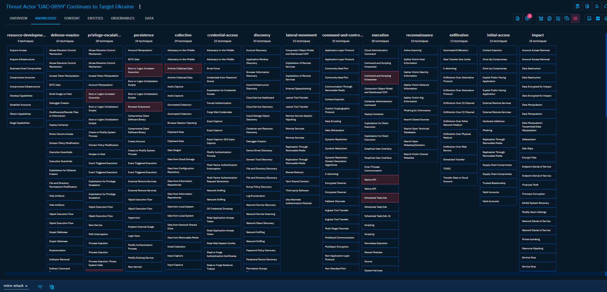
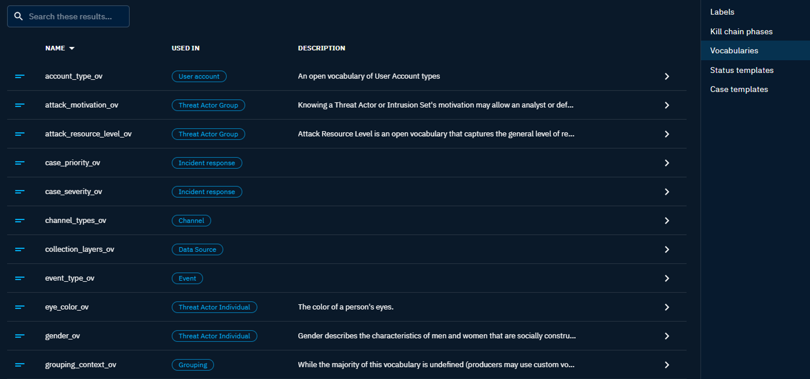
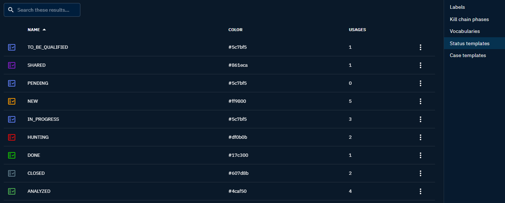
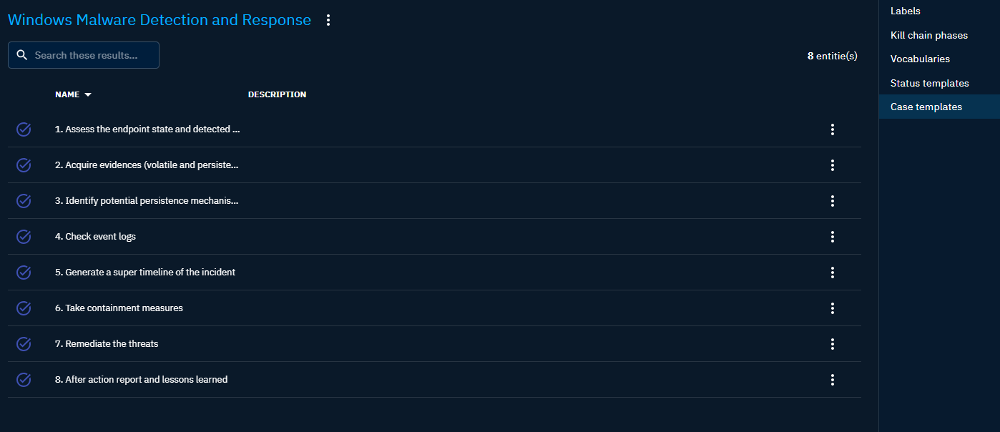

# Taxonomies

Taxonomies in OpenCTI refer to the structured classification systems that help in organizing and categorizing cyber threat intelligence data. They play a crucial role in the platform by allowing analysts to systematically tag and retrieve information based on predefined categories and terms.

## Labels

Labels in OpenCTI serve as a powerful tool for organizing, categorizing, and prioritizing data. Here’s how they can be used effectively:

1. **Tagging and Categorization**: Labels can be used to tag malware, incidents, or indicators (IOCs) with specific categories, making it easier to filter and search through large datasets.
2. **Prioritization**: By labeling threats based on their severity or impact, security analysts can prioritize their response efforts accordingly.
3. **Correlation and Analysis**: Labels help in correlating different pieces of intelligence. For example, if multiple indicators are tagged with the same label, it might indicate a larger campaign or a common adversary.
4. **Automation and Integration**: Labels can trigger [automated workflows](../usage/automation.md) (also called playbooks) within OpenCTI. For instance, a label might automatically initiate further investigation or escalate an incident.
5. **Reporting and Metrics**: Labels facilitate the generation of reports and metrics, allowing organizations to track trends through dashboards, measure response effectiveness, and make data-driven decisions.
6. **Sharing and Collaboration**: When sharing intelligence with other organizations or platforms, labels provide a common language that helps in understanding the context and relevance of the shared data.

!!! tip "Tip"
    
    In order to achieve effective data labeling methods, it is recommended to establish a clear and consistent criteria for your labeling and document them in a policy or guideline.

## Kill chain phases

Kill chain phases are used in OpenCTI to structure and analyze the data related to cyber threats and attacks. They describe the stages of an attack from the perspective of the attacker and provide a framework for identifying, analysing and responding to threats.

OpenCTI supports the following kill chain models:

- **Lockheed Martin Cyber Kill Chain**
- **MITRE ATT&CK Framework (Entreprise, PRE, Mobile and ICS)**
- **DISARM framework**

You can add, edit, or delete kill chain phases in the settings page, and assign them to indicators, attack patterns, incidents, or courses of action in the platform. You can also filter the data by kill chain phase, and view the kill chain phases in a timeline or as a matrix.

## Vocabularies

Open vocabularies are sets of terms and definitions that are agreed upon by the CTI community. They help to standardize the communication documentation of cyber threat information.

Open vocabularies in OpenCTI are mainly based on the [STIX standard](https://docs.oasis-open.org/cti/stix/v2.1/os/stix-v2.1-os.html#_izngjy1g98l2).

## Status templates

Status templates are predefined statuses that can be assigned to different entities in OpenCTI, such as reports, incidents, or cases (incident responses, requests for information and requests for takedown).

They help to track the progress of the analysis and response activities by defining statuses that are used in the [workflows](entities.md#workflow).

## Case templates

Customizable case templates help to streamline the process of creating cases with predefined lists of tasks.

